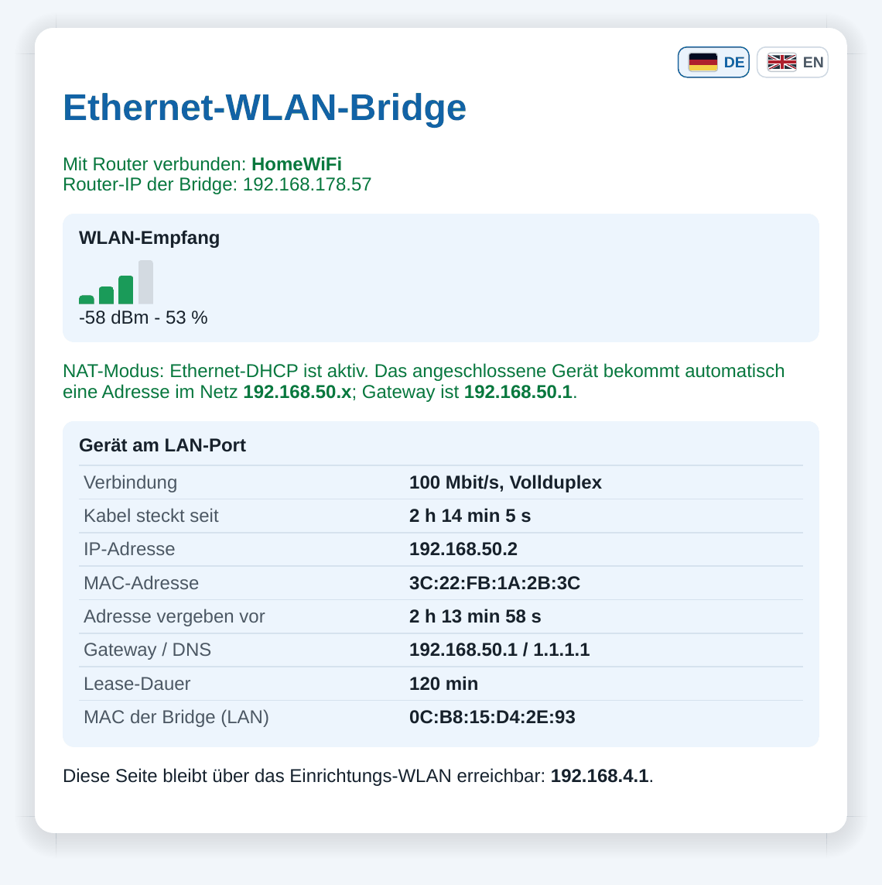
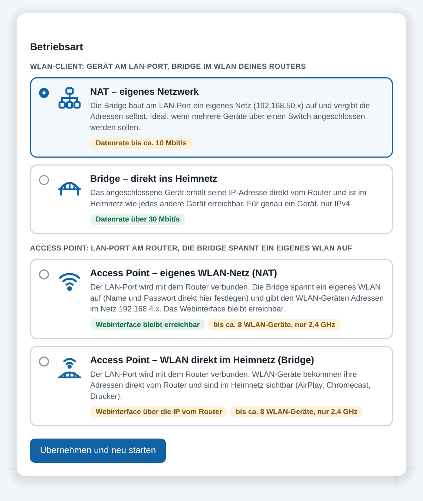
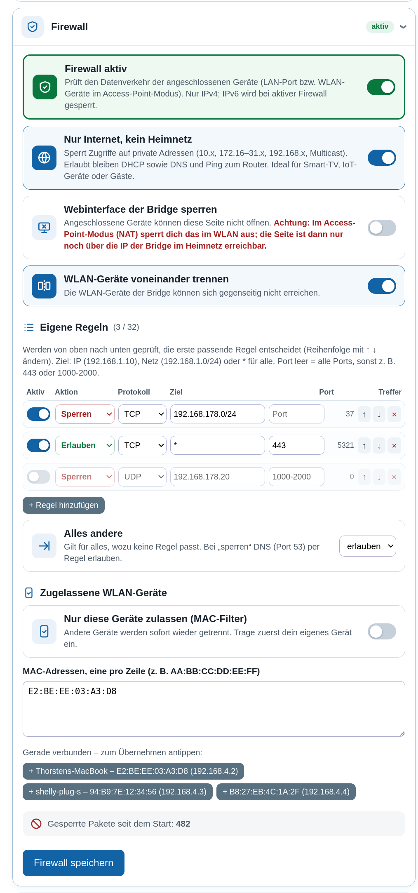
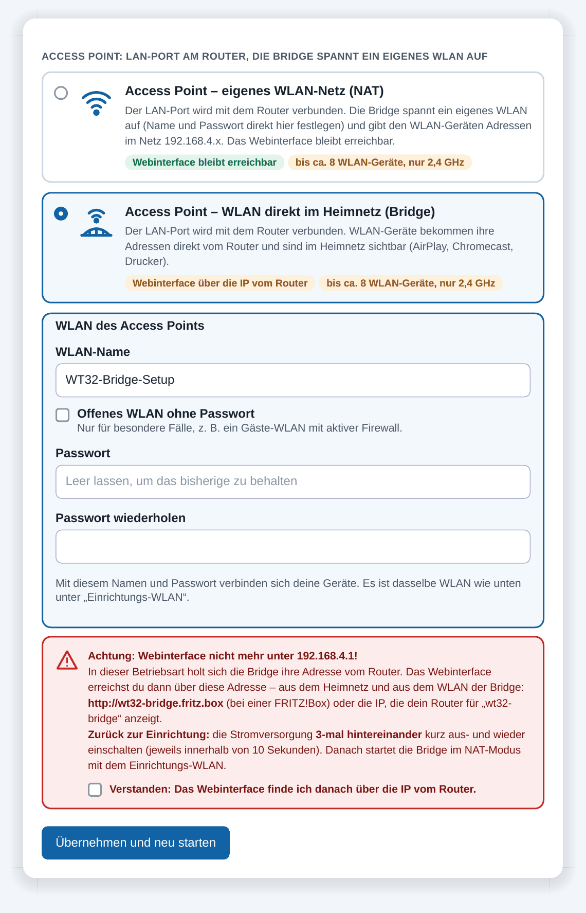
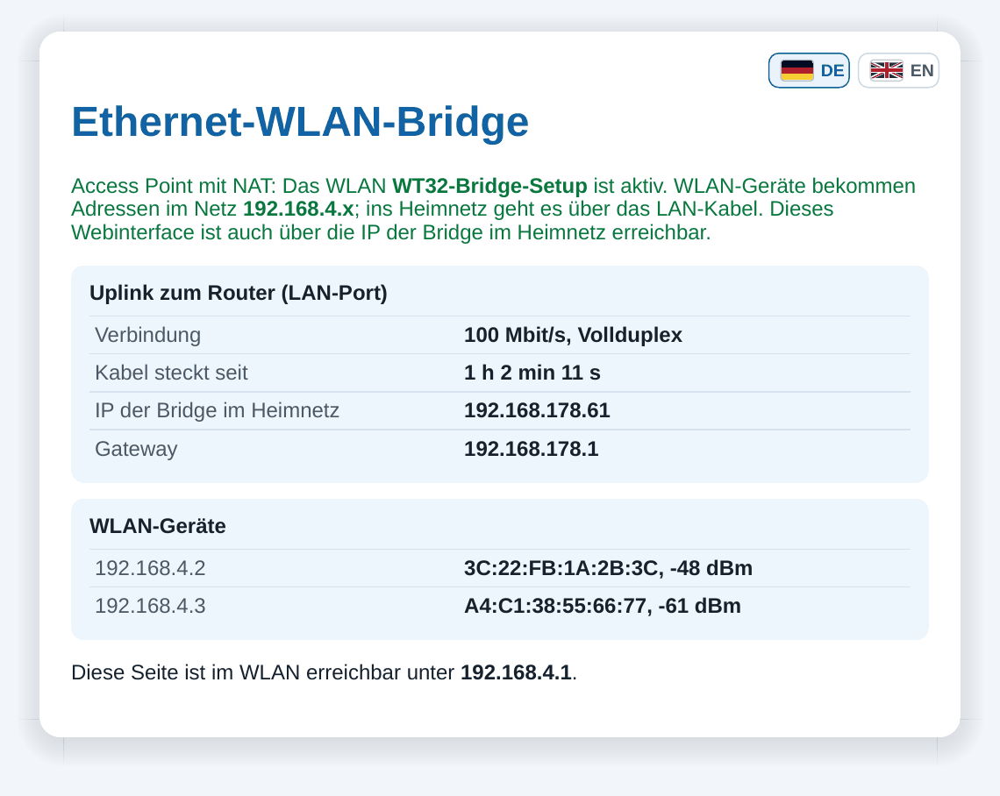
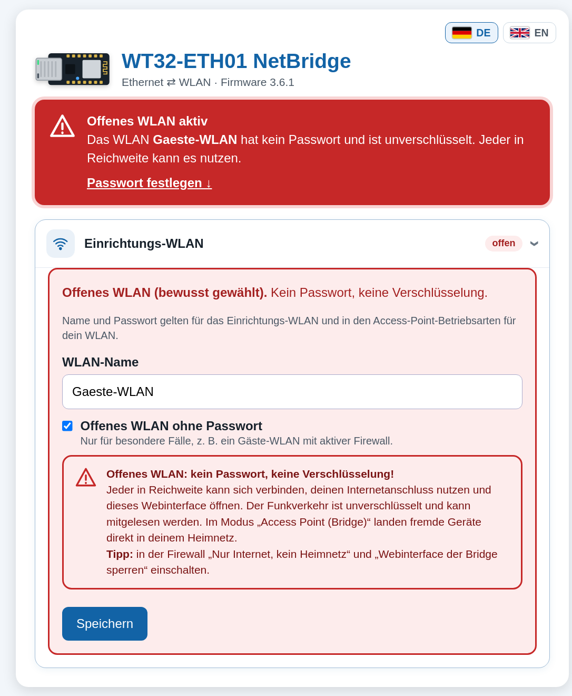

# WT32-ETH01 NetBridge – Ethernet ⇄ WLAN Bridge & Access Point (ESP32 + LAN8720)

🇬🇧 [English](README.md) | 🇩🇪 **Deutsch**

[](CHANGELOG.de.md)
[](#hardware)
[](#bauen-und-flashen)
[](LICENSE)
[](https://buymeacoffee.com/sykh)

**Version 3.0** – siehe [Änderungsprotokoll](CHANGELOG.de.md)

**WT32-ETH01 NetBridge** ist eine Firmware für das **WT32-ETH01 v1.4** (ESP32 + LAN8720), die Ethernet und
WLAN in beide Richtungen verbindet:

- **WLAN-Client:** bringt ein Gerät mit LAN-Anschluss ins WLAN – ein **WLAN-Adapter für Geräte ohne
  WLAN**, z. B. Drucker, Smart-TV, Spielkonsole, NAS, SPS oder Messgeräte.
- **Access Point:** per Kabel am Router, spannt die NetBridge ein **eigenes WLAN** auf – als kleiner
  Access Point, Gäste-WLAN oder WLAN-Erweiterung, auf Wunsch mit Firewall.

<p align="center">
  
</p>

```
WLAN-Client:   [ Gerät mit LAN ] ──Kabel── [ WT32-ETH01 NetBridge ] ))) WLAN ))) [ Router ] ── Internet
Access Point:  [ Handy, Laptop ] ))) WLAN ))) [ WT32-ETH01 NetBridge ] ──Kabel── [ Router ] ── Internet
```

## Webinterface

<p align="center">
  
</p>

Das Webinterface (hier auf Englisch, Version 2.4) im Bridge-Modus: Sprachumschalter, Warnung
solange das Einrichtungs-WLAN kein Passwort hat, WLAN-Empfang, Daten des Geräts am LAN-Port
(IP-Adresse vom Router, Link-Geschwindigkeit, Paketzähler), Router-WLAN, Betriebsart und Passwort
des Einrichtungs-WLANs.

## Screenshots

Alle Screenshots mit Beschreibung: **[Screenshot-Album](docs/SCREENSHOTS.de.md)**.

<table>
<tr><td align='center' width='33%'><a href='docs/SCREENSHOTS.de.md'></a><br><sub>Status im NAT-Modus</sub></td><td align='center' width='33%'><a href='docs/SCREENSHOTS.de.md'></a><br><sub>Betriebsarten</sub></td><td align='center' width='33%'><a href='docs/SCREENSHOTS.de.md'></a><br><sub>Firewall</sub></td></tr>
<tr><td align='center' width='33%'><a href='docs/SCREENSHOTS.de.md'></a><br><sub>Access Point einrichten</sub></td><td align='center' width='33%'><a href='docs/SCREENSHOTS.de.md'></a><br><sub>Status im Access-Point-Modus</sub></td><td align='center' width='33%'><a href='docs/SCREENSHOTS.de.md'></a><br><sub>Bewusst offenes WLAN</sub></td></tr>
</table>

## Funktionen

- **Vier Betriebsarten**, umschaltbar im Webinterface:
  - **NAT – eigenes Netzwerk** (Standard): eigenes Netz `192.168.50.0/24` am LAN-Port mit
    DHCP-Server, Internetfreigabe über NAPT. Mehrere Geräte möglich (z. B. über einen Switch).
    Datenrate bis ca. 10 Mbit/s.
  - **Bridge – direkt ins Heimnetz** (experimentell): Das LAN-Gerät bekommt seine IP **direkt vom
    Router**. Nur ein Gerät, nur IPv4. Datenrate über 30 Mbit/s (Details siehe unten).
  - **Access Point – eigenes WLAN-Netz (NAT)**: Der LAN-Port geht zum Router, die Bridge spannt ein
    eigenes WLAN (`192.168.4.x`) für bis zu ca. 8 Geräte auf. Das Webinterface bleibt erreichbar.
  - **Access Point – WLAN direkt im Heimnetz (Bridge)**: WLAN-Geräte bekommen ihre IP direkt vom
    Router. Das Webinterface ist dann über die IP erreichbar, die der Router der Bridge gibt
    (z. B. `http://wt32-eth01-netbridge.fritz.box`).
- **Live-Datenrate am LAN-Port**: aktueller Download/Upload, Verlauf der letzten 2 Minuten,
  Höchstwerte und Datenmenge seit dem Start.
- **Passwortschutz für das Webinterface** (optional): Anmeldeseite, Sitzungs-Cookie, gespeichert wird nur
  ein gesalzener Hash des Passworts. Empfohlen in den Access-Point-Betriebsarten, weil das Webinterface
  dort auch aus dem Heimnetz erreichbar ist.
- **Notfall-Reset**: 3-mal hintereinander Strom aus/an setzt die Betriebsart auf NAT zurück und entfernt
  das Passwort des Webinterface.
- **Einfache Firewall** für die angeschlossenen Geräte: „Nur Internet, kein Heimnetz“, Webinterface
  sperren, WLAN-Geräte trennen, bis zu 16 eigene Regeln mit Trefferzähler, MAC-Liste in den
  Access-Point-Betriebsarten.
- **Geräteübersicht**: verbundene Geräte mit Namen (aus DHCP), Hersteller (bzw. „Private MAC“),
  IP, Signal, WLAN-Standard, Verbindungsdauer und Restlaufzeit der DHCP-Vergabe.
- **Captive Portal**: Nach dem Verbinden mit dem Einrichtungs-WLAN öffnet sich die Einrichtungsseite
  automatisch.
- **Webinterface** auf **Deutsch und Englisch** (umschaltbar per Flaggen-Button) über ein eigenes
  Einrichtungs-WLAN (Passwort im Webinterface änderbar):
  - WLAN-Suche und Eingabe der Router-Zugangsdaten
  - Anzeige der WLAN-Signalstärke
  - Infos zum Gerät am LAN-Port: IP-Adresse, MAC-Adresse, Link-Geschwindigkeit/Duplex,
    Verbindungsdauer, im Bridge-Modus zusätzlich Paketzähler
- Zugangsdaten und Betriebsart werden dauerhaft im Flash (NVS) gespeichert.
- Keine externen Bibliotheken nötig.

## Hardware

- WT32-ETH01 v1.4 von Wireless-Tag: ESP32-Modul, LAN8720-Ethernet-PHY, RJ45-Buchse (10/100 Mbit/s),
  Versorgung mit 5 V **oder** 3,3 V
- USB-TTL-Adapter mit **3,3 V**-Logik zum Flashen (z. B. CP2102 oder CH340)

| Adapter | WT32-ETH01 |
|---------|------------|
| TX      | RX0 (GPIO3) |
| RX      | TX0 (GPIO1) |
| GND     | GND |
| 5V      | 5V (oder 3,3 V an 3V3, nur eines von beiden) |

Zum Flashen **IO0 mit GND verbinden** und dann das Board einschalten. Nach dem Flashen die Brücke
entfernen und neu starten.

### Pinbelegung der Stiftleisten

Laut [Wireless-Tag-Wiki](https://wiki.wireless-tag.com/docs/en/WT32-ETH01/board_features.html):

| Leiste 1 | Funktion | Leiste 2 | Funktion |
|----------|----------|----------|----------|
| EN | Enable (aktiv high) | GND | Masse |
| CFG | IO32 (Werksreset) | IO39 | nur Eingang |
| 485_EN | IO33 (RS485-Enable) | IO36 | nur Eingang |
| RXD | IO5 (UART2 RX) | IO15 | GPIO |
| TXD | IO17 (UART2 TX) | IO14 | GPIO |
| GND | Masse | IO12 | GPIO |
| 3V3 | 3,3 V Ein-/Ausgang | IO35 | nur Eingang |
| GND | Masse | IO4 | GPIO |
| 5V | 5 V Ein-/Ausgang | IO2 | GPIO |
| LINK | Link-LED | GND | Masse |

Zum Flashen dienen die Programmier-Pins **TXD0 (IO1), RXD0 (IO3), GND, 3V3, EN und IO0**.

Verwendete Pins intern: GPIO16 (Oszillator-Enable LAN8720), GPIO23 (MDC), GPIO18 (MDIO),
GPIO0 (50-MHz-RMII-Takt-Eingang), PHY-Adresse 1.

## Bauen und Flashen

Eine ausführliche Schritt-für-Schritt-Anleitung (auch ohne Kommandozeile) steht im
**[Tutorial](docs/TUTORIAL.de.md)**.

Kurzfassung mit [PlatformIO](https://platformio.org/) (`brew install platformio`):

```bash
pio run -t upload        # bauen und flashen
pio device monitor       # serielle Ausgabe (115200 Baud)
```

Die Firmware braucht **Arduino-Core 3.x (ESP-IDF 5)**. Die `platformio.ini` nutzt dafür die
[pioarduino](https://github.com/pioarduino/platform-espressif32)-Plattform. Mit dem Standard-Paket
`platform = espressif32` (Arduino-Core 2.x) lässt sich der Ethernet-Teil nicht kompilieren.

## Einrichtung

1. Mit dem WLAN **`WT32-ETH01-NetBridge-Setup`** verbinden. Beim ersten Start ist es **offen (ohne Passwort)**.
2. Die Einrichtungsseite öffnet sich automatisch (Captive Portal, wie bei Hotel-WLANs). Falls nicht,
   `http://192.168.4.1` öffnen.
3. Router-WLAN auswählen, Passwort eingeben, speichern.
4. Ein Passwort für das Einrichtungs-WLAN festlegen (bis dahin zeigt das Webinterface eine rote Warnung).
5. Gerät per Kabel am LAN-Port anschließen.

## WLAN-Passwörter

Die Bridge kennt zwei Passwörter:

| Passwort | Wo steht es? | Wie ändern? |
|----------|--------------|-------------|
| **Einrichtungs-WLAN** `WT32-ETH01-NetBridge-Setup` (anfangs **offen**, ohne Passwort) | im Flash des ESP32 (NVS); ein optionaler Standardwert lässt sich in `SETUP_AP_PASSWORD` in `src/main.cpp` setzen | im Webinterface unter „Einrichtungs-WLAN“ (8–63 Zeichen), die Bridge startet danach neu |
| **Router-WLAN** | im Flash des ESP32 (NVS), nicht im Code | im Webinterface unter „Router-WLAN“ neu eingeben und „Speichern und verbinden“ |

> **Bewusst offenes WLAN:** In den WLAN-Einstellungen (und bei den Access-Point-Betriebsarten) lässt
> sich „Offenes WLAN ohne Passwort“ anhaken, z. B. für ein Gäste-WLAN. Eine rote Warnung erklärt die
> Risiken und bleibt oben im Webinterface sichtbar; am besten mit der Firewall kombinieren („Nur
> Internet“, „Webinterface sperren“).

> **Wichtig:** Beim ersten Start ist das Einrichtungs-WLAN offen, jeder in Reichweite könnte die
> Einstellungen ändern. Das Webinterface zeigt eine auffällige rote Warnung, bis ein Passwort gesetzt
> ist. Lege es direkt nach der Einrichtung fest. Details: [Tutorial, Abschnitt WLAN-Passwörter](docs/TUTORIAL.de.md#7-wlan-passwörter-finden-und-ändern).

## Betriebsarten im Detail

### NAT – eigenes Netzwerk

Die Bridge baut am LAN-Port ein eigenes Netz auf und vergibt die Adressen selbst. Ideal, wenn
mehrere Geräte über einen Switch angeschlossen werden sollen. Datenraten bis ca. 10 Mbit/s.

- Bridge-Adresse im LAN: `192.168.50.1` (Gateway)
- DHCP-Bereich: `192.168.50.x`, DNS: `1.1.1.1`
- Internetverkehr wird per NAPT über das WLAN geleitet.

### Bridge – direkt ins Heimnetz (experimentell)

Das angeschlossene Gerät erhält seine IP-Adresse direkt vom Router und ist im Heimnetz wie jedes
andere Gerät erreichbar. Datenraten über 30 Mbit/s.

Ein WLAN-Client darf nur Pakete mit seiner eigenen MAC-Adresse senden. Die Bridge schreibt deshalb
die MAC-Adressen in den Paketen um, auch in DHCP- und ARP-Paketen. Das gleiche Verfahren nutzt
Espressifs Beispiel
[`sta2eth`](https://github.com/espressif/esp-idf/tree/master/examples/network/sta2eth).

Einschränkungen:

- nur **ein** Gerät am LAN-Port, nur **IPv4**
- im Router erscheint das Gerät mit der **WLAN-MAC der Bridge** (wird im Webinterface angezeigt).
  Feste IP-Zuweisungen im Router müssen auf diese MAC eingetragen werden.
- die Bridge hat im Router-Netz keine eigene IP; das Webinterface ist nur über das
  Einrichtungs-WLAN erreichbar
- nutzt interne ESP-IDF-WLAN-Funktionen (`esp_wifi_internal_*`), die sich mit Core-Updates
  ändern können
- nach dem Umschalten der Betriebsart am LAN-Gerät kurz das Kabel ziehen, damit es eine neue
  Adresse holt

### Access Point – eigenes WLAN-Netz (NAT)

Den LAN-Port mit dem Router verbinden. Die Bridge holt sich per DHCP eine Adresse vom Router und
spannt ein eigenes WLAN auf (Name und Passwort aus dem Abschnitt „Einrichtungs-WLAN“). Die
WLAN-Geräte bekommen Adressen im Netz `192.168.4.x`; als DNS dient der DNS-Server des Routers. Das
Webinterface bleibt unter `192.168.4.1` und über die IP der Bridge im Heimnetz erreichbar.

- bis ca. 8 WLAN-Geräte, nur 2,4 GHz, die Datenrate teilen sich alle Geräte
- vor dem Umschalten muss ein WLAN-Passwort festgelegt sein

### Access Point – WLAN direkt im Heimnetz (Bridge)

Den LAN-Port mit dem Router verbinden. Die Frames werden auf Ebene 2 zwischen Ethernet und dem
WLAN-Access-Point weitergereicht (wie in Espressifs Beispiel
[`eth2ap`](https://github.com/espressif/esp-idf/tree/master/examples/network/eth2ap)). Die
WLAN-Geräte bekommen ihre Adressen direkt vom Router und sind im Heimnetz sichtbar (AirPlay,
Chromecast, Drucker).

> **Hinweis:** In dieser Betriebsart ist das Webinterface **nicht mehr unter 192.168.4.1** erreichbar.
> Die Bridge holt sich per DHCP eine eigene Adresse vom Router (Gerätename `wt32-eth01-netbridge`); unter dieser
> Adresse ist das Webinterface erreichbar – aus dem Heimnetz und aus dem WLAN der Bridge, z. B.
> `http://wt32-eth01-netbridge.fritz.box` oder die IP aus der Geräteliste des Routers. Vor dem Umschalten fragt
> das Webinterface nach einer Bestätigung.
>
> **Zurück zur Einrichtung (Notfall-Reset):** die Stromversorgung **3-mal hintereinander** kurz aus-
> und wieder einschalten, jeweils innerhalb von 10 Sekunden. Danach startet die Bridge im NAT-Modus mit
> dem Einrichtungs-WLAN, und das Passwort des Webinterface ist entfernt; alle anderen Einstellungen
> bleiben erhalten.

## Firewall

Abschnitt „Firewall“ im Webinterface. Sie prüft den Datenverkehr der **angeschlossenen Geräte**
(Gerät am LAN-Port bzw. die WLAN-Geräte in den Access-Point-Betriebsarten). Änderungen gelten sofort,
ein Neustart ist nicht nötig.

| Einstellung | Wirkung |
|-------------|---------|
| Nur Internet, kein Heimnetz | sperrt private Adressen (10.x, 172.16–31.x, 192.168.x, Multicast); DHCP, DNS und Ping zum Router bleiben erlaubt. In den Bridge-Betriebsarten werden zusätzlich Verbindungen aus dem Heimnetz zum Gerät gesperrt. |
| Webinterface der Bridge sperren | angeschlossene Geräte können die Einstellungsseite nicht öffnen |
| WLAN-Geräte trennen (AP-Betriebsarten) | die WLAN-Geräte der Bridge erreichen sich gegenseitig nicht |
| Eigene Regeln (bis zu 16) | sperren/erlauben, Protokoll (alle/TCP/UDP/ICMP), Ziel-IP oder -Netz, Port oder Portbereich; die erste passende Regel entscheidet; Trefferzähler je Regel |
| Alles andere | erlauben (Standard) oder sperren |
| MAC-Filter (AP-Betriebsarten) | nur eingetragene WLAN-Geräte dürfen sich verbinden; schützt vor dem Selbstaussperren |

Grenzen: zustandslos (keine Verbindungsverfolgung; in den NAT-Betriebsarten blockiert NAT ohnehin
unaufgeforderte Verbindungen von außen), nur IPv4 (IPv6 wird bei aktiver Firewall gesperrt), nur
IP-Adressen, keine Domainnamen.

## Projektstruktur

```
platformio.ini            Build-Konfiguration
src/main.cpp              Firmware
src/oui_table.h           Herstellertabelle (MAC-Präfixe), erzeugt von tools/gen_oui.py
docs/TUTORIAL.de.md       Tutorial: Kompilieren und Flashen (Deutsch)
docs/TUTORIAL.en.md       Tutorial: build and flash (English)
docs/webinterface-v2.4.png Screenshot des Webinterface (echtes Gerät)
docs/SCREENSHOTS.de.md    Screenshot-Album (DE), docs/screenshots/en|de/
docs/wt32-eth01-netbridge-banner.png Banner auf der Startseite
tools/make_preview.py     erzeugt Banner und Vorschaubild neu
docs/wt32-eth01.svg       Illustration des Boards
docs/social-preview.png   Vorschaubild für GitHub
CHANGELOG.de.md           Änderungsprotokoll (Deutsch)
CHANGELOG.md              changelog (English)
LICENSE                   MIT-Lizenz
tools/release.sh          baut die Firmware und legt einen GitHub-Release an
tools/gen_oui.py          erzeugt src/oui_table.h neu aus der IEEE-OUI-Liste
backup/main_nat_only.cpp  ältere Version nur mit NAT-Modus
```

## Versionen

Aktuelle Version: **3.3** – Live-Datenrate am LAN-Port.
Fertige Firmware-Dateien hängen an jedem [Release](../../releases).
Alle Änderungen stehen im **[Änderungsprotokoll](CHANGELOG.de.md)**.

## Unterstützen

Wenn dir das Projekt hilft, freue ich mich über einen Kaffee:

<a href="https://buymeacoffee.com/sykh"></a>

## Fehlersuche

Die serielle Ausgabe (115200 Baud) zeigt den Zustand an, z. B.:

```
Betriebsart: NAT
DHCP server started on interface ETH_LAN with IP: 192.168.50.1
Ethernet-LAN: 192.168.50.1, DHCP-Server laeuft
Ethernet-Kabel verbunden (100 Mbit/s, Vollduplex)
LAN-Geraet AA:BB:CC:DD:EE:FF hat 192.168.50.2 bekommen
```

Weitere Hinweise stehen im [Tutorial](docs/TUTORIAL.de.md#8-probleme-lösen).

## Lizenz

Veröffentlicht unter der [MIT-Lizenz](LICENSE): Der Code darf frei verwendet, verändert und
weitergegeben werden, auch kommerziell. Der Copyright-Hinweis muss dabei erhalten bleiben.
