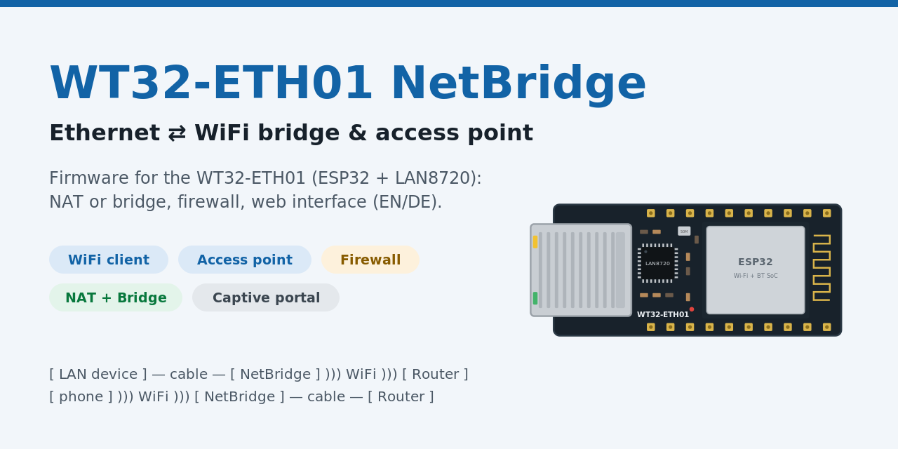
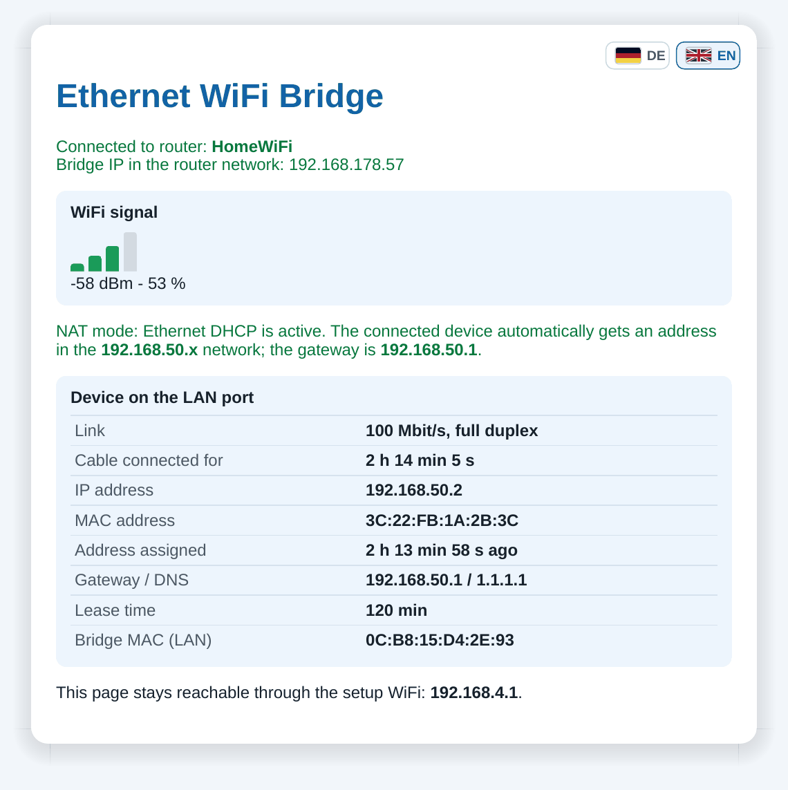
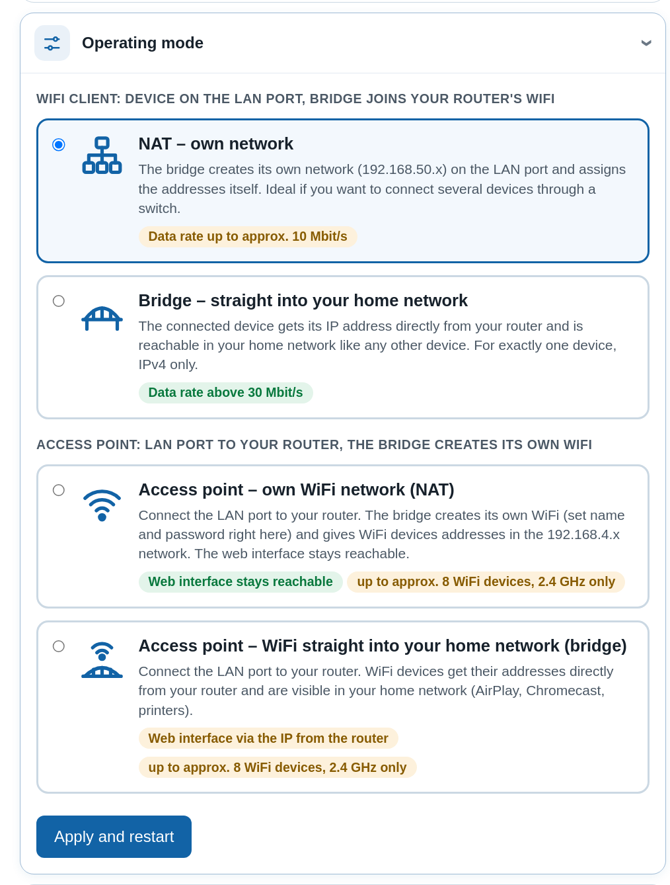
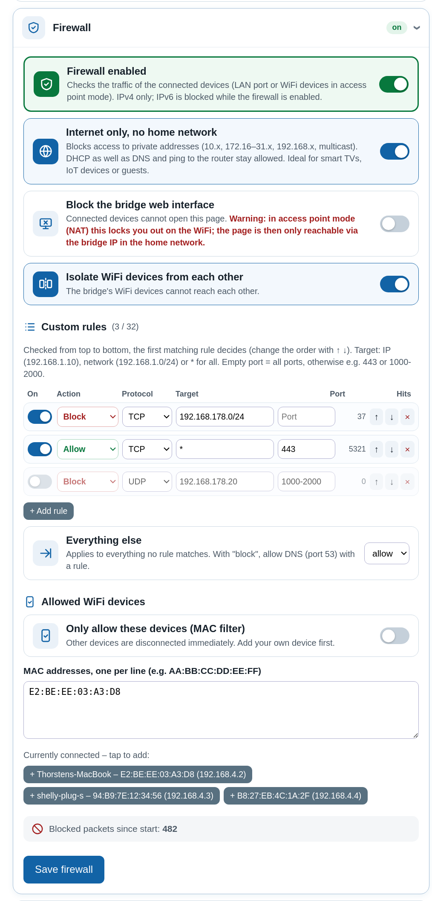
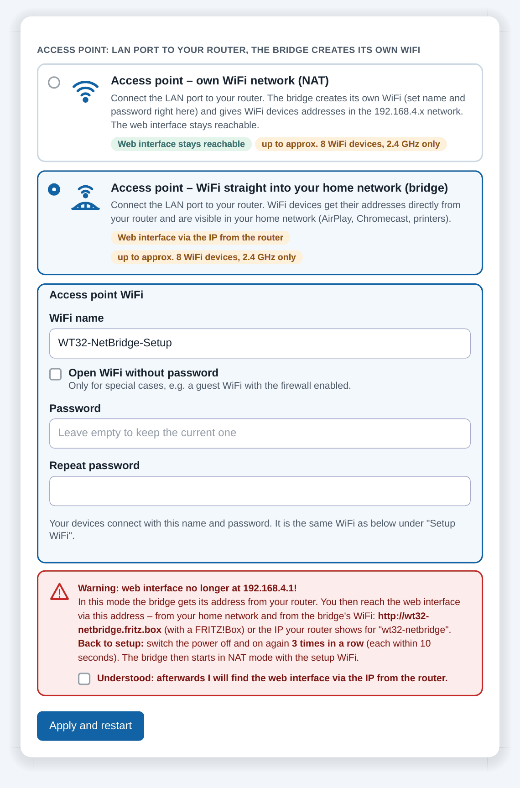
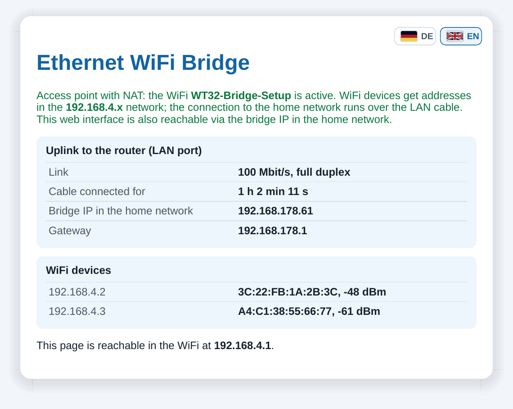
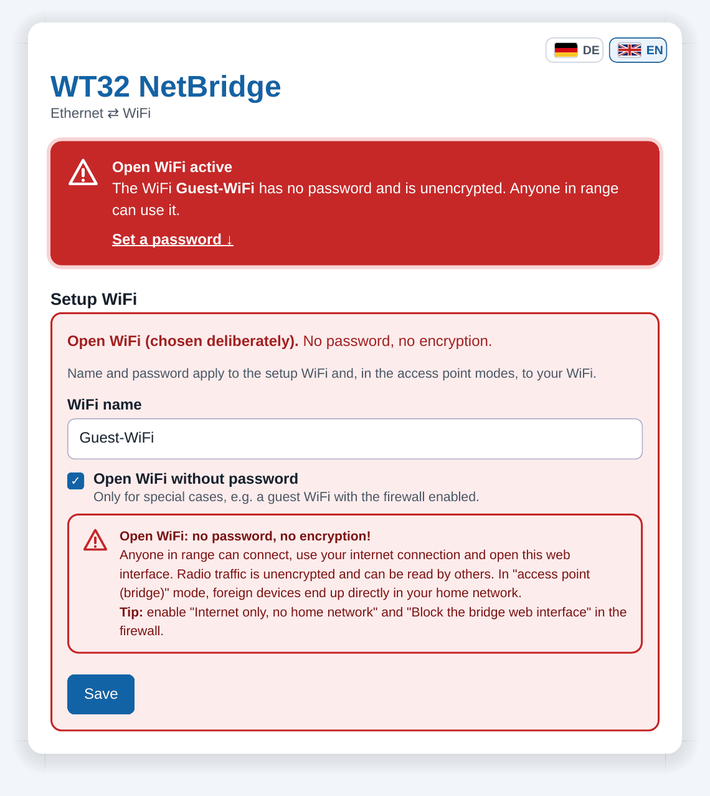

# WT32-ETH01 NetBridge – Ethernet ⇄ WiFi Bridge & Access Point (ESP32 + LAN8720)

🇬🇧 **English** | 🇩🇪 [Deutsch](README.de.md)

[](CHANGELOG.md)
[](#hardware)
[](#build-and-flash)
[](LICENSE)
[](https://buymeacoffee.com/sykh)

**Version 3.0** – see the [changelog](CHANGELOG.md)

**WT32-ETH01 NetBridge** is a firmware for the **WT32-ETH01 v1.4** (ESP32 + LAN8720) that connects
Ethernet and WiFi in both directions:

- **WiFi client:** brings a device with an Ethernet port into your WiFi – a **WiFi adapter for
  devices without WiFi** such as printers, smart TVs, game consoles, NAS, PLCs or measuring
  instruments.
- **Access point:** connected to your router by cable, it creates its **own WiFi** – as a small
  access point, guest WiFi or WiFi extension, optionally with a firewall.

<p align="center">
  
</p>

```
WiFi client:   [ LAN device ] ──cable── [ WT32-ETH01 NetBridge ] ))) WiFi ))) [ Router ] ── Internet
Access point:  [ phone, laptop ] ))) WiFi ))) [ WT32-ETH01 NetBridge ] ──cable── [ Router ] ── Internet
```

## Web interface

<p align="center">
  
</p>

The web interface (English, version 2.4) in bridge mode: language switch, warning while the setup
WiFi has no password, WiFi signal strength, details of the device on the LAN port (IP address from
the router, link speed, packet counters), router WiFi, operating mode and setup WiFi password.
The interface is available in English and German and can be switched with the flag buttons at the
top right.

## Screenshots

All screenshots with descriptions: **[screenshot album](docs/SCREENSHOTS.md)**.

<table>
<tr><td align='center' width='33%'><a href='docs/SCREENSHOTS.md'></a><br><sub>Status in NAT mode</sub></td><td align='center' width='33%'><a href='docs/SCREENSHOTS.md'></a><br><sub>Operating modes</sub></td><td align='center' width='33%'><a href='docs/SCREENSHOTS.md'></a><br><sub>Firewall</sub></td></tr>
<tr><td align='center' width='33%'><a href='docs/SCREENSHOTS.md'></a><br><sub>Access point setup</sub></td><td align='center' width='33%'><a href='docs/SCREENSHOTS.md'></a><br><sub>Status in access point mode</sub></td><td align='center' width='33%'><a href='docs/SCREENSHOTS.md'></a><br><sub>Open WiFi (on purpose)</sub></td></tr>
</table>

## Features

- **Four operating modes**, selectable in the web interface:
  - **NAT – own network** (default): separate subnet `192.168.50.0/24` on the LAN port with a DHCP
    server, internet access through NAPT. Several devices possible (e.g. via a switch).
    Data rate up to approx. 10 Mbit/s.
  - **Bridge – straight into your home network** (experimental): the LAN device gets its IP address
    **directly from your router**. One device only, IPv4 only. Data rate above 30 Mbit/s.
  - **Access point – own WiFi network (NAT)**: the LAN port goes to your router, the bridge creates
    its own WiFi (`192.168.4.x`) for up to approx. 8 devices. The web interface stays reachable.
  - **Access point – WiFi straight into your home network (bridge)**: WiFi devices get their IP
    directly from your router. The web interface is then reachable via the IP the router assigns to
    the bridge (e.g. `http://wt32-eth01-netbridge.fritz.box`).
- **Live data rate on the LAN port**: current download/upload, chart of the last 2 minutes, peak
  values and data volume since start.
- **Password protection for the web interface** (optional): login page, session cookie, only a salted
  hash of the password is stored. Recommended in the access point modes, where the web interface is
  also reachable from the home network.
- **Emergency reset**: switching the power off and on 3 times in a row returns to NAT mode and removes
  the web interface password.
- **Simple firewall** for the connected devices: "Internet only, no home network", block the web
  interface, isolate WiFi devices, up to 16 custom rules with hit counters, MAC allow list in the
  access point modes.
- **Device overview**: connected devices with name (from DHCP), manufacturer (or "private MAC"),
  IP, signal, WiFi standard, connection time and remaining DHCP lease time.
- **Captive portal**: after connecting to the setup WiFi, the setup page opens automatically.
- **Web interface** in **English and German** (switchable via flag buttons) via a dedicated setup
  WiFi (password changeable in the web interface):
  - WiFi scan and entry of the router credentials
  - WiFi signal strength
  - Info about the device on the LAN port: IP address, MAC address, link speed/duplex,
    connection time, plus packet counters in bridge mode
- Credentials and operating mode are stored permanently in flash (NVS).
- No external libraries required.

## Hardware

- WT32-ETH01 v1.4 by Wireless-Tag: ESP32 module, LAN8720 Ethernet PHY, RJ45 jack (10/100 Mbit/s),
  powered by 5 V **or** 3.3 V
- USB-to-serial adapter with **3.3 V** logic for flashing (e.g. CP2102 or CH340)

| Adapter | WT32-ETH01 |
|---------|------------|
| TX      | RX0 (GPIO3) |
| RX      | TX0 (GPIO1) |
| GND     | GND |
| 5V      | 5V (or 3.3 V to 3V3, never both) |

To flash, **connect IO0 to GND** and then power up the board. Remove the jumper afterwards and
restart.

### Header pinout

According to the [Wireless-Tag wiki](https://wiki.wireless-tag.com/docs/en/WT32-ETH01/board_features.html):

| Header 1 | Function | Header 2 | Function |
|----------|----------|----------|----------|
| EN | Enable (active high) | GND | Ground |
| CFG | IO32 (factory reset) | IO39 | input only |
| 485_EN | IO33 (RS485 enable) | IO36 | input only |
| RXD | IO5 (UART2 RX) | IO15 | GPIO |
| TXD | IO17 (UART2 TX) | IO14 | GPIO |
| GND | Ground | IO12 | GPIO |
| 3V3 | 3.3 V in/out | IO35 | input only |
| GND | Ground | IO4 | GPIO |
| 5V | 5 V in/out | IO2 | GPIO |
| LINK | Link LED | GND | Ground |

Flashing uses the programming pins **TXD0 (IO1), RXD0 (IO3), GND, 3V3, EN and IO0**.

Pins used internally: GPIO16 (LAN8720 oscillator enable), GPIO23 (MDC), GPIO18 (MDIO),
GPIO0 (50 MHz RMII clock input), PHY address 1.

## Build and flash

A detailed step-by-step guide (including a way without the command line) is in the
**[tutorial](docs/TUTORIAL.en.md)**.

Short version with [PlatformIO](https://platformio.org/):

```bash
pio run -t upload        # build and flash
pio device monitor       # serial output (115200 baud)
```

The firmware requires **Arduino Core 3.x (ESP-IDF 5)**. `platformio.ini` uses the
[pioarduino](https://github.com/pioarduino/platform-espressif32) platform for this. With the stock
`platform = espressif32` package (Arduino Core 2.x) the Ethernet part does not compile.

## Setup

1. Connect to the WiFi **`WT32-ETH01-NetBridge-Setup`**. On first start it is **open (no password)**.
2. The setup page opens automatically (captive portal, like in hotel WiFis). If not, open
   `http://192.168.4.1`.
3. Select your router's WiFi, enter the password, save.
4. Set a password for the setup WiFi (the web interface shows a red warning until you do).
5. Connect the device to the LAN port.

## WiFi passwords

The bridge uses two passwords:

| Password | Where is it stored? | How to change it? |
|----------|---------------------|-------------------|
| **Setup WiFi** `WT32-ETH01-NetBridge-Setup` (initially **open**, no password) | in the ESP32's flash (NVS); an optional default can be set in `SETUP_AP_PASSWORD` in `src/main.cpp` | in the web interface under "Setup WiFi" (8–63 characters), the bridge restarts |
| **Router WiFi** | in the ESP32's flash (NVS), not in the code | enter it again in the web interface under "Router WiFi" and click "Save and connect" |

> **Open WiFi on purpose:** in the WiFi settings (and with the access point modes) you can tick
> "Open WiFi without password", e.g. for a guest WiFi. A red warning explains the risks and stays
> visible at the top of the web interface; combine it with the firewall ("Internet only", "Block
> the web interface").

> **Important:** on first start the setup WiFi is open, so anyone in range could change the
> settings. The web interface shows a prominent red warning until you set a password; do this
> right after setup. Details: [tutorial, WiFi passwords](docs/TUTORIAL.en.md#7-find-and-change-the-wifi-passwords).

## Operating modes in detail

### NAT – own network

The bridge creates its own network on the LAN port and assigns the addresses itself. Ideal if you
want to connect several devices through a switch. Data rates up to approx. 10 Mbit/s.

- Bridge address on the LAN: `192.168.50.1` (gateway)
- DHCP range: `192.168.50.x`, DNS: `1.1.1.1`
- Internet traffic is routed over WiFi using NAPT.

### Bridge – straight into your home network (experimental)

The connected device gets its IP address directly from your router and is reachable in your home
network like any other device. Data rates above 30 Mbit/s.

A WiFi client may only send frames with its own MAC address. The bridge therefore rewrites the MAC
addresses in the frames, including DHCP and ARP packets. Espressif's
[`sta2eth`](https://github.com/espressif/esp-idf/tree/master/examples/network/sta2eth) example uses
the same technique.

Limitations:

- **one** device on the LAN port, **IPv4** only
- the router sees the device with the **WiFi MAC address of the bridge** (shown in the web
  interface). Static IP reservations in the router must use this MAC.
- the bridge has no IP address of its own in the router's network; the web interface is only
  reachable through the setup WiFi
- uses internal ESP-IDF WiFi functions (`esp_wifi_internal_*`), which may change with core updates
- after switching the operating mode, unplug the cable of the LAN device briefly so it requests a
  new address

### Access point – own WiFi network (NAT)

Connect the LAN port to your router. The bridge gets an address from the router via DHCP and creates
its own WiFi (name and password from the "Setup WiFi" section). WiFi devices get addresses in the
`192.168.4.x` network; DNS is the router's DNS server. The web interface stays reachable at
`192.168.4.1` and via the bridge's IP in the home network.

- up to approx. 8 WiFi devices, 2.4 GHz only, the data rate is shared by all devices
- a WiFi password must be set before this mode can be selected

### Access point – WiFi straight into your home network (bridge)

Connect the LAN port to your router. Frames are passed between Ethernet and the WiFi access point
on layer 2 (like Espressif's
[`eth2ap`](https://github.com/espressif/esp-idf/tree/master/examples/network/eth2ap) example). WiFi
devices get their addresses directly from your router and are visible in the home network
(AirPlay, Chromecast, printers).

> **Note:** in this mode the web interface is **no longer at 192.168.4.1**. The bridge gets its own
> address from your router via DHCP (hostname `wt32-eth01-netbridge`) and the web interface is reachable at
> that address – from the home network and from the bridge's WiFi, e.g. `http://wt32-eth01-netbridge.fritz.box`
> or the IP shown in your router's device list. The web interface asks for a confirmation before
> switching.
>
> **Back to setup (emergency reset):** switch the power off and on again **3 times in a row**, each
> time within 10 seconds. The bridge then starts in NAT mode with the setup WiFi and the web interface
> password is removed; all other settings are kept.

## Firewall

Section "Firewall" in the web interface. It checks the traffic of the **connected devices** (device
on the LAN port, or the WiFi devices in the access point modes). Changes apply immediately, no restart
needed.

| Option | Effect |
|--------|--------|
| Internet only, no home network | blocks private addresses (10.x, 172.16–31.x, 192.168.x, multicast); DHCP, DNS and ping to the router stay allowed. In the bridge modes it also blocks connections from the home network to the device. |
| Block the bridge web interface | connected devices cannot open the settings page |
| Isolate WiFi devices (AP modes) | WiFi devices of the bridge cannot reach each other |
| Custom rules (up to 16) | block/allow, protocol (all/TCP/UDP/ICMP), target IP or network, port or port range; first match wins; hit counter per rule |
| Everything else | allow (default) or block |
| MAC filter (AP modes) | only listed WiFi devices may connect; protects you from locking yourself out |

Limitations: stateless (no connection tracking; NAT already blocks unsolicited inbound traffic in
the NAT modes), IPv4 only (IPv6 is blocked while the firewall is enabled), IP addresses only, no
domain names.

## Project structure

```
platformio.ini            build configuration
src/main.cpp              firmware
src/oui_table.h           manufacturer table (MAC prefixes), generated by tools/gen_oui.py
docs/TUTORIAL.en.md       tutorial: build and flash (English)
docs/TUTORIAL.de.md       Tutorial: Kompilieren und Flashen (Deutsch)
docs/webinterface-v2.4.png screenshot of the web interface (real device)
docs/SCREENSHOTS.md       screenshot album (EN), docs/screenshots/en|de/
docs/wt32-eth01-netbridge-banner.png banner on the start page
tools/make_preview.py     regenerates banner and social preview
docs/wt32-eth01.svg       board illustration
docs/social-preview.png   GitHub preview image
tools/release.sh          builds the firmware and creates a GitHub release
tools/gen_oui.py          regenerates src/oui_table.h from the IEEE OUI list
backup/main_nat_only.cpp  older version with NAT mode only
CHANGELOG.md              changelog (English)
CHANGELOG.de.md           Änderungsprotokoll (Deutsch)
LICENSE                   MIT license
```

## Versions

Current version: **3.3** – live data rate on the LAN port.
Ready-made firmware files are attached to each [release](../../releases).
All changes are listed in the **[changelog](CHANGELOG.md)**.

## Support

If this project helps you, I'd be happy about a coffee:

<a href="https://buymeacoffee.com/sykh"></a>

## Troubleshooting

The serial output (115200 baud) shows the current state, for example:

```
WT32-ETH01 NetBridge, Firmware 3.1
Betriebsart: NAT
DHCP server started on interface ETH_LAN with IP: 192.168.50.1
Ethernet-LAN: 192.168.50.1, DHCP-Server laeuft
Ethernet-Kabel verbunden (100 Mbit/s, Vollduplex)
LAN-Geraet AA:BB:CC:DD:EE:FF hat 192.168.50.2 bekommen
```

The log messages are in German. More hints are in the
[tutorial](docs/TUTORIAL.en.md#8-troubleshooting).

## License

Released under the [MIT license](LICENSE): you may use, modify and distribute the code freely,
including commercially, as long as the copyright notice is kept.
