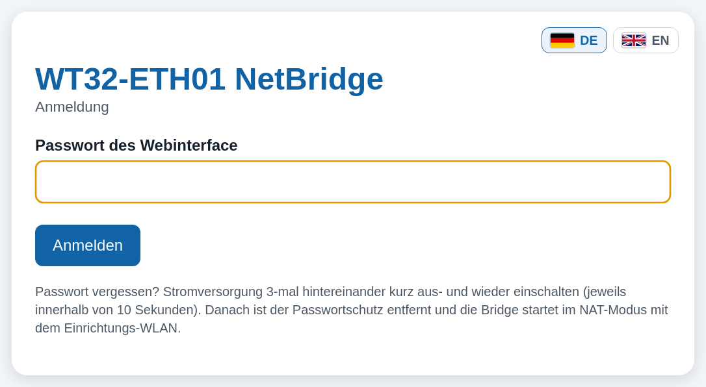
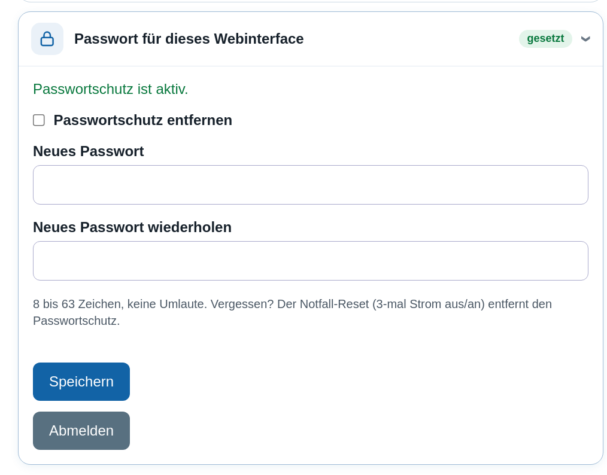

# Screenshots

🇬🇧 [English](SCREENSHOTS.md) | 🇩🇪 **Deutsch**

Webinterface der Firmware 3.6 (WT32-ETH01 NetBridge). Die Seiten wurden von der Firmware selbst erzeugt und in Chromium dargestellt; die Live-Werte (Signal, Geräte, Datenrate, Zähler) sind Beispieldaten.

Zurück zur [Projektbeschreibung](../README.de.md).

## 1. Status im NAT-Modus

Kopfbereich mit Board (Status-LEDs), Betriebsart und Statuskacheln; WLAN-Empfang, Datenrate mit Verlauf und das Gerät am LAN-Port mit Name, Hersteller und Restlaufzeit der Adresse.

## 2. Status im Bridge-Modus

Das LAN-Gerät bekommt seine IP direkt vom Router; Paketzähler und Datenrate.

## 3. WLAN-Suche

Netzwerke suchen und die Router-Zugangsdaten eintragen.

## 4. Betriebsarten

Vier Betriebsarten als Karten mit Piktogrammen und Datenraten.

## 5. Access Point einrichten

WLAN-Name und Passwort direkt bei der Betriebsart, mit Hinweis zum Webinterface.

## 6. Firewall

Schalter mit Piktogrammen, bis zu 32 eigene Regeln (hinzufügen, verschieben, löschen) mit Trefferzählern, Grundregel und MAC-Filter.

## 7. Status im Access-Point-Modus

Uplink mit Datenrate, WLAN-Geräte mit Namen, Signal und Lease sowie die Geräte im Heimnetz (Access Point als Bridge).

## 8. Bewusst offenes WLAN

Eigene Option mit sichtbarer Warnung.

## 9. Erster Start

Pulsierende Warnung, bis ein WLAN-Passwort gesetzt ist.

## 10. Anmeldung

Anmeldeseite, wenn ein Passwort für das Webinterface gesetzt ist.

## 11. Passwort für das Webinterface

Passwortschutz festlegen, ändern oder entfernen; Abmelden.

