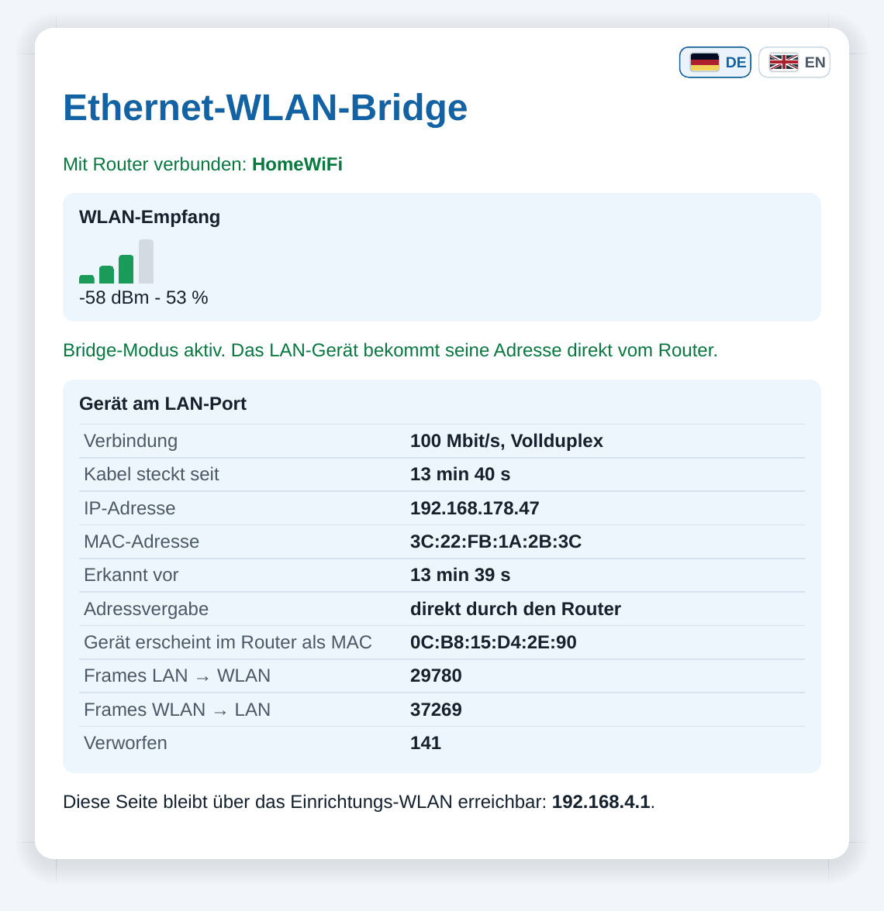
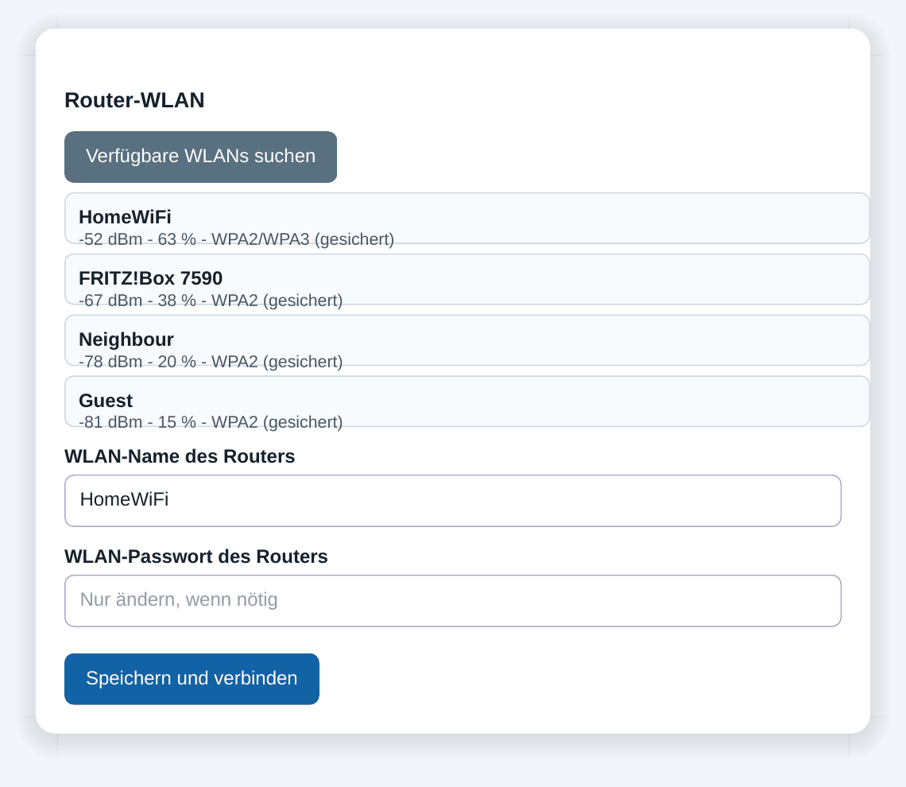
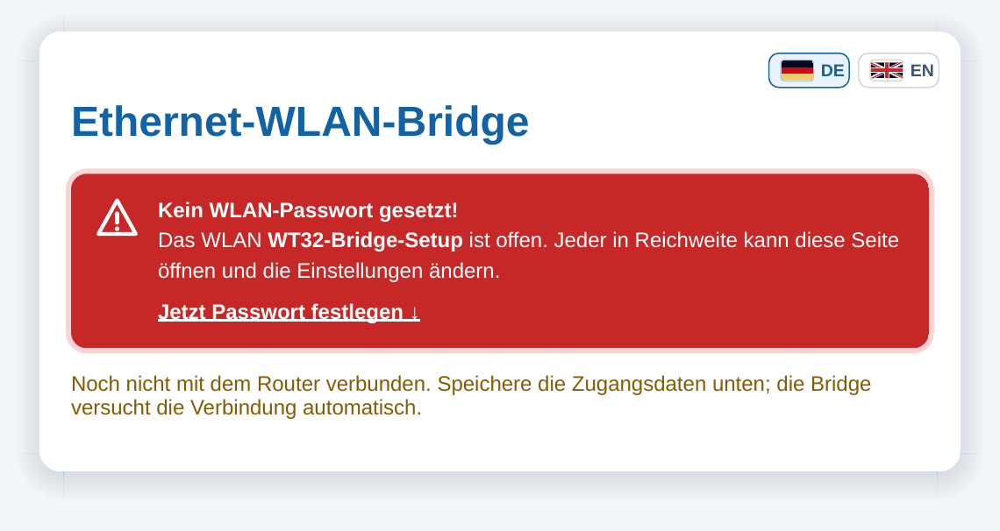

# Screenshots

🇬🇧 [English](SCREENSHOTS.md) | 🇩🇪 **Deutsch**

Webinterface der Firmware 2.8. Die Seiten wurden von der Firmware selbst erzeugt; die Live-Werte (Signal, Geräte, Zähler) sind Beispieldaten.

Zurück zur [Projektbeschreibung](../README.de.md).

## 1. Status im NAT-Modus

WLAN-Empfang und das Gerät am LAN-Port (IP, MAC, Verbindung, Lease).

## 2. Status im Bridge-Modus

Das LAN-Gerät bekommt seine IP direkt vom Router; Paketzähler.

## 3. WLAN-Suche

Netzwerke suchen und die Router-Zugangsdaten eintragen.

## 4. Betriebsarten

Vier Betriebsarten als Karten mit Piktogrammen und Datenraten.

## 5. Access Point einrichten

WLAN-Name und Passwort direkt bei der Betriebsart, mit Hinweis zum Webinterface.

## 6. Firewall

Schalter, eigene Regeln mit Trefferzählern und MAC-Filter.

## 7. Status im Access-Point-Modus

Uplink zum Router und verbundene WLAN-Geräte.

## 8. Bewusst offenes WLAN

Eigene Option mit sichtbarer Warnung.

## 9. Erster Start

Pulsierende Warnung, bis ein WLAN-Passwort gesetzt ist.

