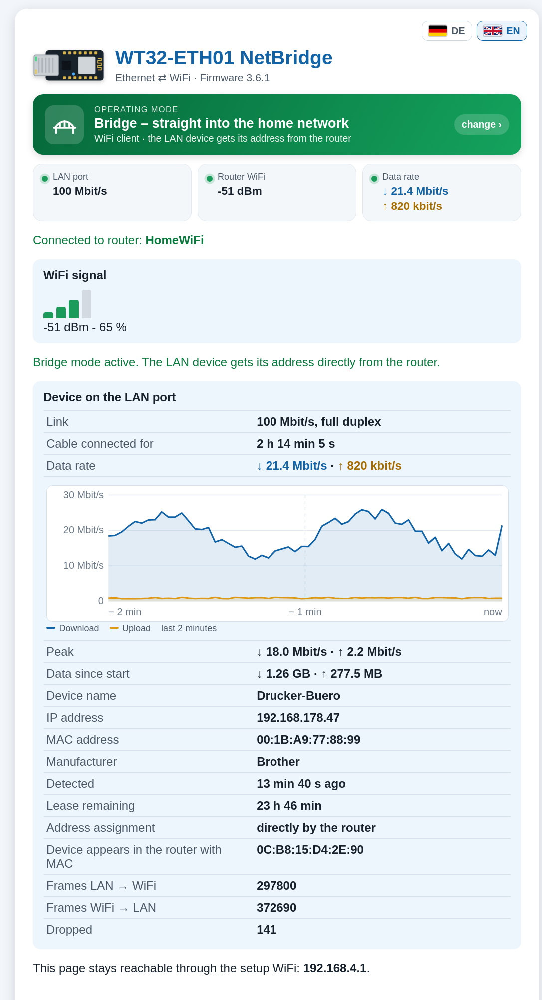
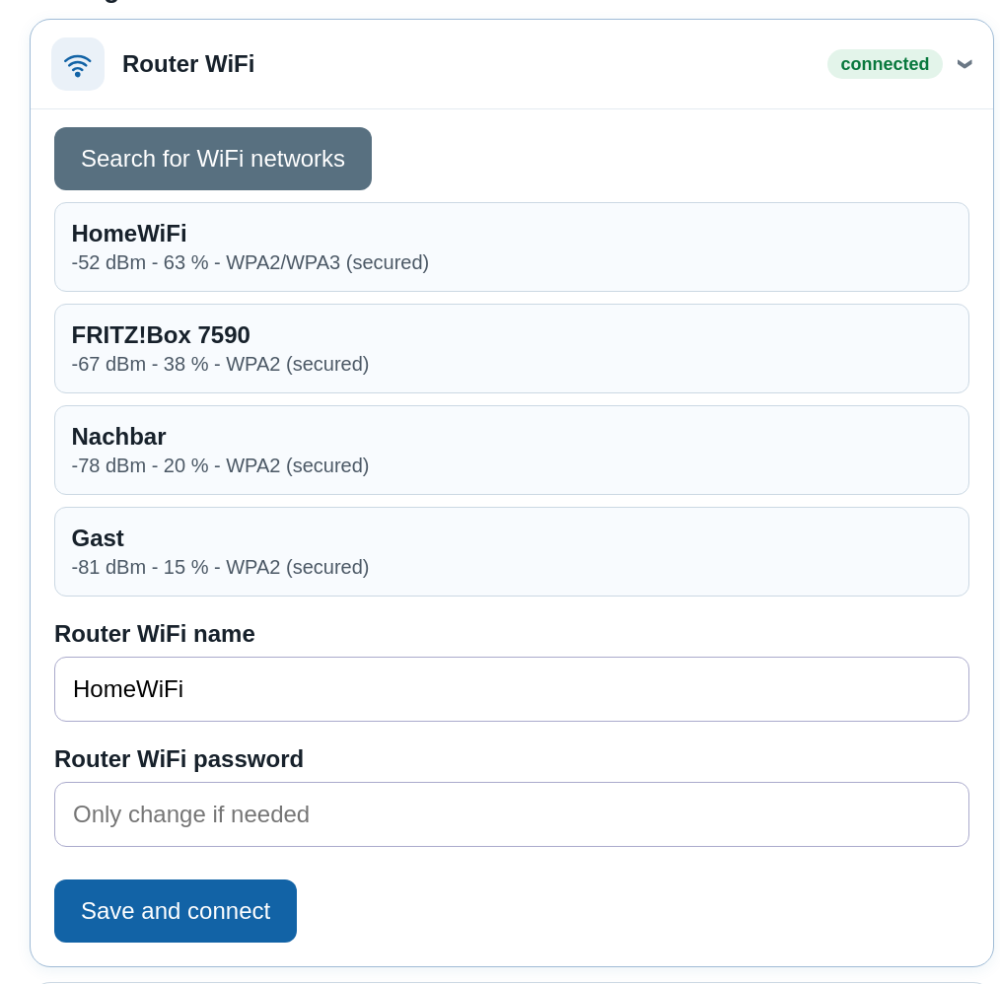
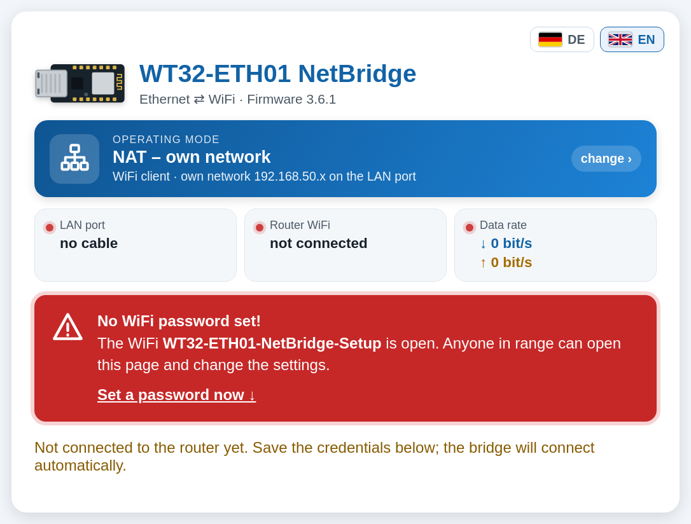
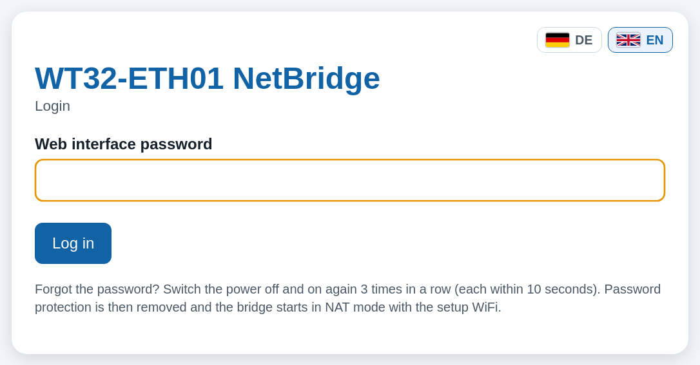
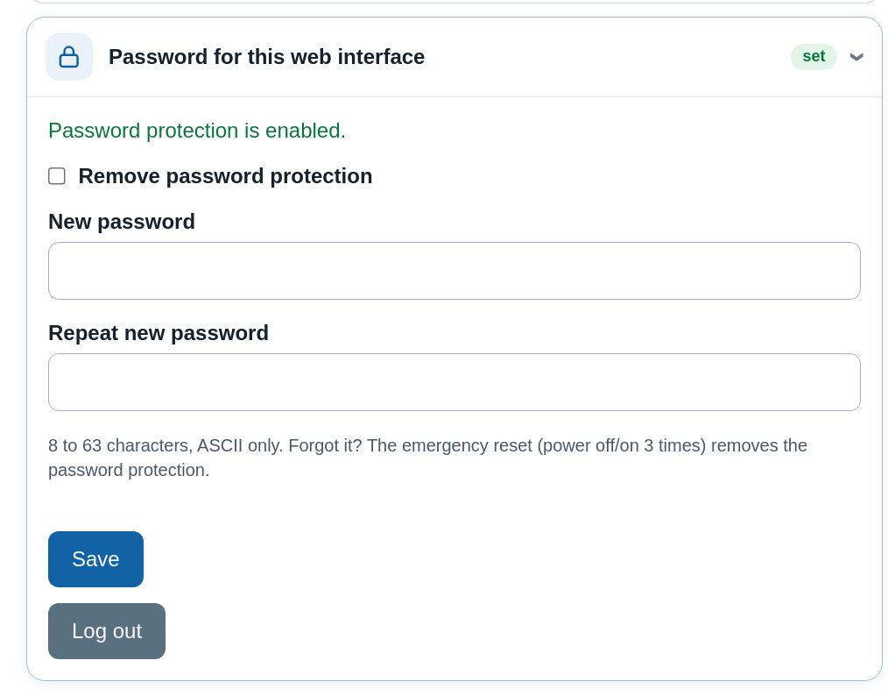

# Screenshots

🇬🇧 **English** | 🇩🇪 [Deutsch](SCREENSHOTS.de.md)

Web interface of firmware 3.6 (WT32-ETH01 NetBridge). The pages were generated by the firmware itself and rendered in Chromium; the live values (signal, devices, data rate, counters) are sample data.

Back to the [project description](../README.md).

## 1. Status in NAT mode

Header with the board (status LEDs), operating mode and status tiles; WiFi signal, data rate with chart and the device on the LAN port with name, manufacturer and remaining lease time.

## 2. Status in bridge mode

The LAN device gets its IP directly from the router; packet counters and data rate.

## 3. WiFi scan

Search for networks and enter the router credentials.

## 4. Operating modes

Four operating modes as cards with pictograms and data rates.

## 5. Access point setup

WiFi name and password right at the operating mode, with a note about the web interface.

## 6. Firewall

Toggles with pictograms, up to 32 custom rules (add, move, delete) with hit counters, default rule and MAC filter.

## 7. Status in access point mode

Uplink with data rate, WiFi devices with name, signal and lease, and the devices in the home network (access point bridge).

## 8. Open WiFi (on purpose)

Separate option with a visible warning.

## 9. First start

Pulsing warning until a WiFi password is set.

## 10. Login

Login page when a web interface password is set.

## 11. Web interface password

Set, change or remove the password protection; log out.

